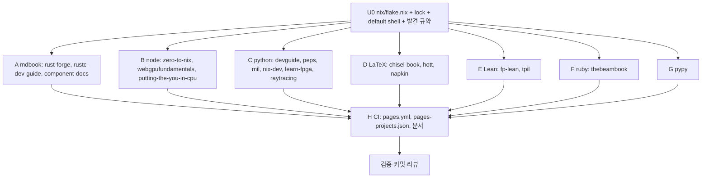

# Nix devShell 통일 구현 plan

spec: `docs/superpowers/specs/2026-09-12-nix-devshells-design.md`

## 단위와 의존성

Wave 1: U0. Wave 2: A–G 병렬(쓰기 범위: 각자 `nix/projects/<name>.nix`와
`projects/<name>/` 내부만; `nix/flake.nix`, `nix/flake.lock`, `.github/`는 금지). Wave 3: H.

## 각 단위의 완료 기준

- devShell 파일이 `{ pkgs, lib, system }: pkgs.mkShell { … }` 규약을 따르고 `nix develop path:nix#<name>`이 진입한다.
- `yeokja.toml` 빌드 명령과 스크립트에서 `GITHUB_ACTIONS`·macOS 전용 PATH 분기가 없어진다.
- README의 로컬 준비 절이 `nix develop path:../../nix#<name> -c ../../target/release/yeokja build <target>`으로 바뀐다(해당 문장 주위만).
- 증거: 로컬(aarch64-darwin)에서 `.github/scripts/rebuild-translations.sh <name>` 후 devShell 안에서 `yeokja build <target>`이 성공한 로그. 빌드가 수십 분 이상 걸리는 경우(napkin pdf, hott, Lean) 셸 진입과 도구 버전 확인 + 빌드 시도 결과를 있는 그대로 보고한다.

